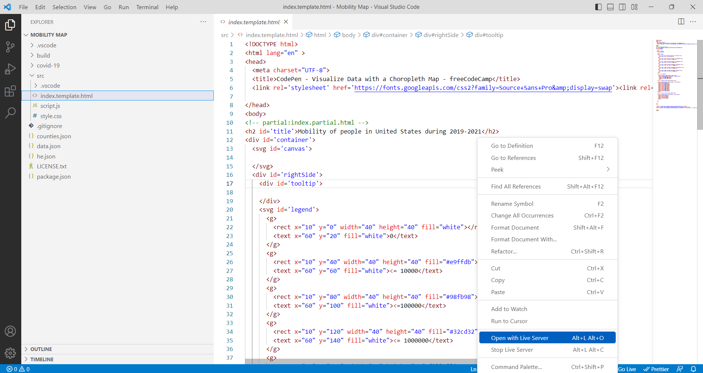

# Calculating the effectiveness of restricting people’s movement during the pandemic using visual analytics

**Navaneeth reddy Chinthi reddy, Ridhuparan Kungumaraju**

We aim to understand the relationship between people’s mobility and COVID-19 cases in the US. We analyze over 50 million data entries from January 2020 to December 2022, covering both county and state levels. We create several maps and plots to visualize the distribution of population, the spread of the virus, and the changes in mobility patterns. We provide insights for policy-making and intervention design for future pandemics. 

The project files are inside the folder "project" in folder-wise manner. The project contains the following maps and chats : 

 1. Maps
	 1. Population Map
	 2. Mobility Map 
	 3. Cumulative Covid Cases Map
	 4. Weekly New Covid Cases Map
	 5. Scaled Covid Cases Map (Cumulative Covid Cases / Population of the county )
2. Charts (State wise)
	1. Weekly New Covid Cases Charts
	2. Weekly Mobily Charts
	3. Combined Chart

The data required for the maps and charts were obtained from the following sources :
1. US Covid Flows Mobility Data (2019-2021)
Link : https://github.com/GeoDS/COVID19USFlows
2.  NYTimes Covid Cases  
Link : https://github.com/nytimes/covid-19-data
3.  Population Data
Link : https://www.census.gov/data/datasets/time-series/demo/popest/2010s-counties-total.html

The python scripts used to preprocess the data and create the json files required for the maps and charts are also attached with the project folder.

**Steps required to run the project**

 1. Clone the github repository
	 1. git clone https://github.com/ridhu-uic/FinalProject.git
 2. Open the required folder in vscode. eg : Mobility Map. *Same procedure can be followed for other maps.
 3. Open the index.template.html and use a live server to launch the map.

 
